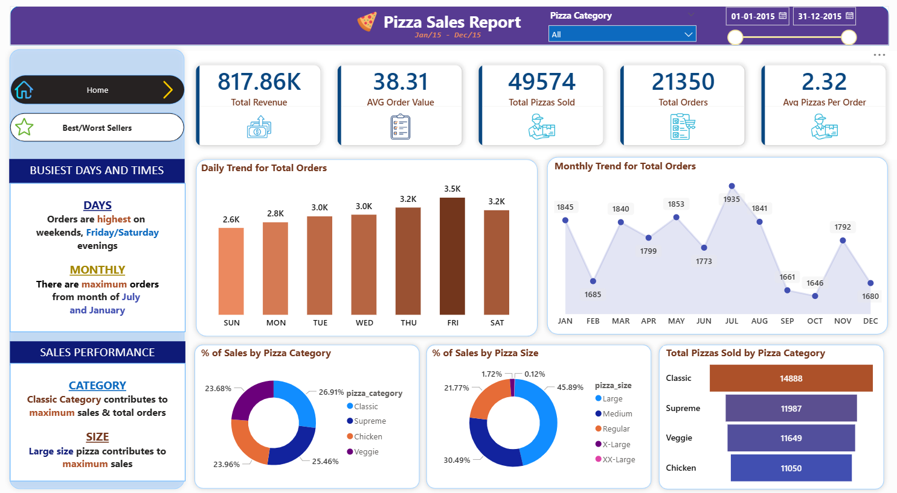

# 🍕 Pizza_Sales_Dashboard

📌 Project Overview 

This project presents an interactive Pizza Sales Dashboard built using Power BI to analyze sales performance, customer ordering behavior, and product trends. The dashboard converts raw transactional data into clear, actionable business insights, helping stakeholders understand revenue drivers and demand patterns.

The analysis focuses on sales KPIs, time-based trends, product performance, and customer preferences, enabling data-driven decision-making in a competitive food service environment.

🔹 Objectives

- Monitor overall pizza sales performance
- Track key revenue and order-related KPIs
- Analyze daily and monthly order trends
- Identify peak sales days and time periods
- Determine top-performing pizza categories and sizes
- Support inventory planning and promotional strategies

🛠 Tools & Technologies

Power BI – Data modeling, DAX measures, and dashboard visualization
SQL – Data cleaning, transformation, and aggregation

📊 Key Performance Indicators (KPIs)

- Total Revenue
- Average Order Value (AOV)
- Total Pizzas Sold
- Total Orders
- Average Pizzas per Order

📈 Dashboard Features

🔹 Sales Trend Analysis

- Daily Trend for Total Orders
  Displays order volume patterns across weekdays and weekends.

- Monthly Trend for Total Orders
  Highlights seasonality, with peak demand observed in July and January.

🔹 Busiest Days & Times

- Highest order volume occurs on weekends, particularly Friday and Saturday evenings, indicating peak customer demand.

🔹 Product Performance Analysis

- Sales % by Pizza Category
  Comparison across Classic, Supreme, Chicken, and Veggie pizzas.

- Sales % by Pizza Size
  Customer preference analysis for Large, Medium, Regular, X-Large, and XX-Large sizes.

- Total Pizzas Sold by Category
  Classic pizzas generate the highest sales volume and total orders.

- Pizza Size Contribution
  Large-sized pizzas contribute the maximum share of total sales.

🔹 Best & Worst Sellers

- Quickly identifies top-performing and underperforming products to guide marketing and menu optimization.

💡 Key Insights

- Weekend evenings drive the highest sales volume.
- Classic category dominates both revenue and order count.
- Large pizzas are the most preferred size among customers.
- Seasonal spikes suggest opportunities for targeted promotions during peak months.

🚀 Impact & Use Cases

- Helps management identify high-performing products
- Supports demand forecasting and inventory planning
- Enables data-backed promotional and pricing strategies
- Demonstrates practical Power BI + SQL analytics skills

📸 Dashboard

